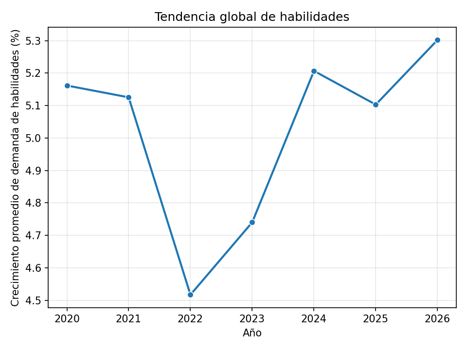
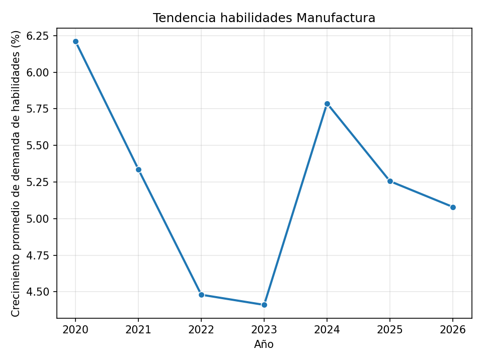
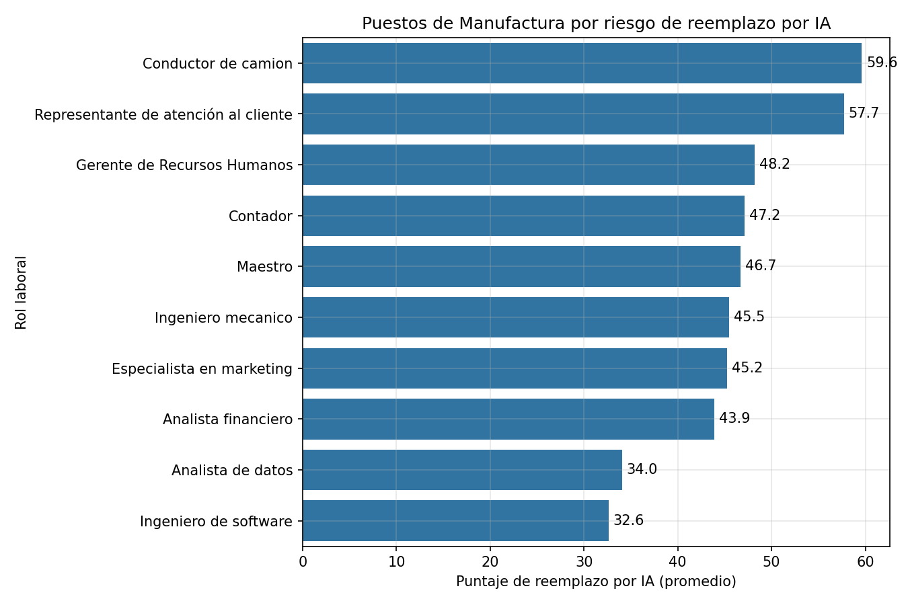
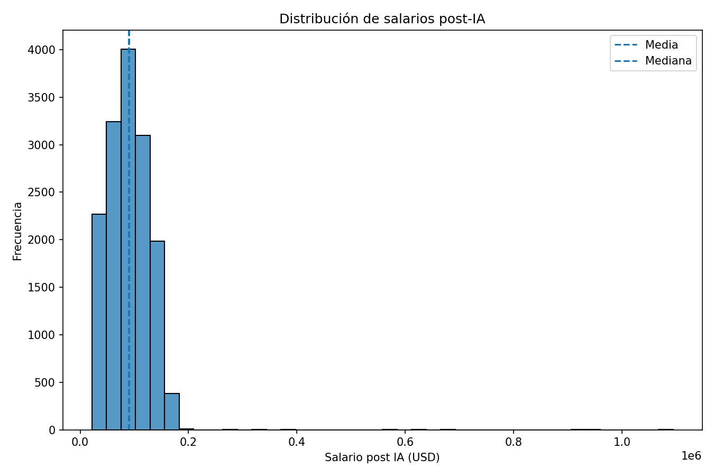
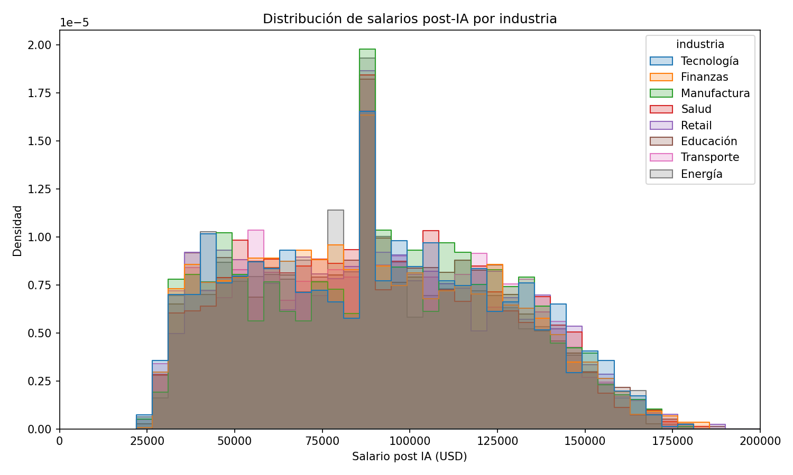
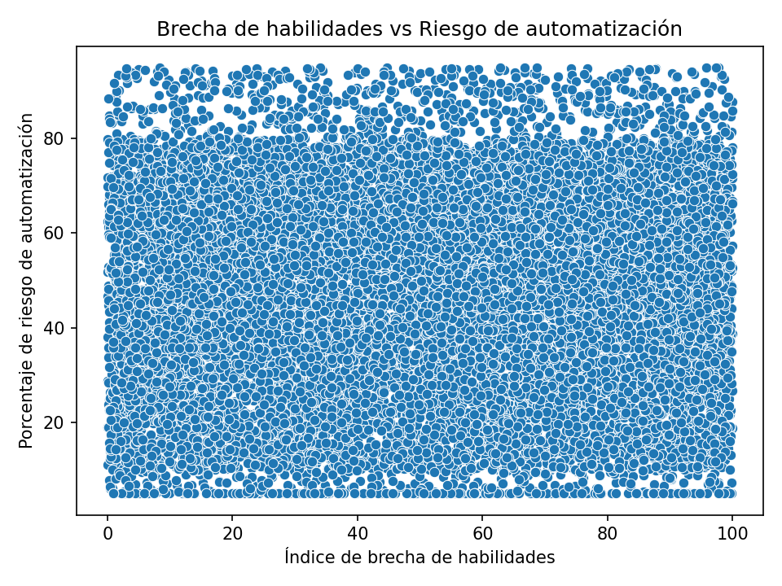
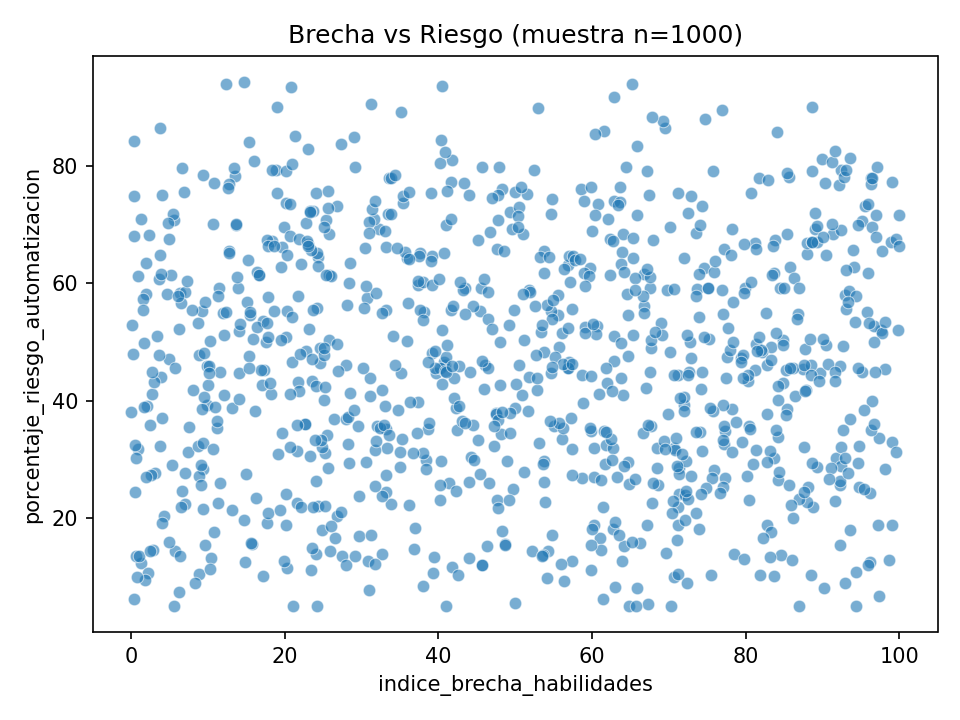
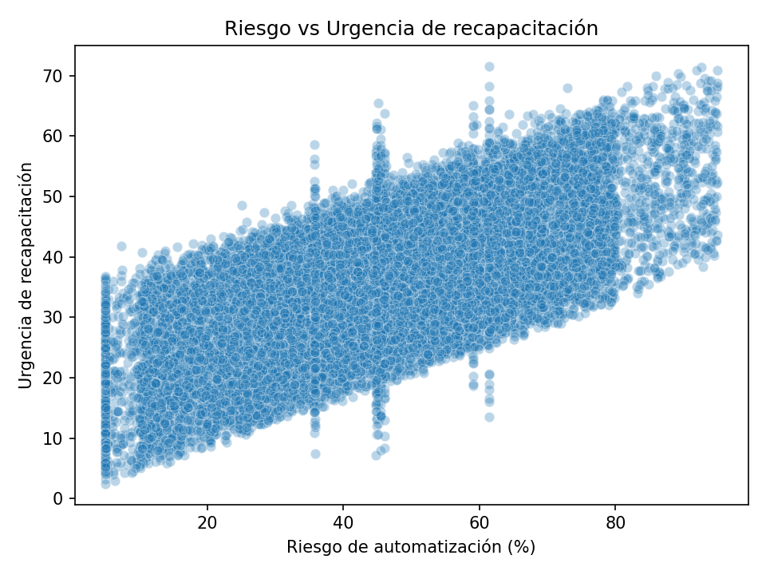

# Impacto de la IA sobre el empleo — análisis de datos con Python

Trabajo práctico de Ciencia de Datos. Toma un dataset sucio de 15.050 registros sobre riesgo de
automatización laboral, lo audita, lo limpia siguiendo un protocolo de curación documentado, y sobre
el resultado corre un análisis estadístico y visual centrado en la industria de **Manufactura**.

Todo el proyecto está modularizado: `main.py` orquesta el flujo y cada bloque de análisis vive en su
propio módulo dentro de `modulos/`.

## Pregunta que guía el trabajo

> ¿La IA está impulsando una *fábrica sin humanos* o una fábrica de *empleados premium*?

La respuesta corta que arrojan los datos es la segunda: no hay una caída salarial generalizada ni una
mayoría de trabajadores en alto riesgo, sino una **polarización**. La media salarial de Manufactura
sube levemente (+136,84 USD) mientras la mediana cae (−755,54 USD), es decir que un grupo reducido de
roles captura los beneficios y arrastra el promedio hacia arriba mientras el trabajador típico pierde
poder salarial. La caída de la mediana en Manufactura es **3,78 veces mayor** que la caída general
del dataset.

## Estructura del proyecto

```
.
├── main.py                 <- orquesta las cuatro fases y se ejecuta de punta a punta
├── requirements.txt
├── datos/
│   └── ai_job_replacement_dirty.csv
├── modulos/
│   ├── carga.py                              <- lectura del CSV
│   ├── auditoria_inicial.py                  <- Fase I: diagnóstico de calidad
│   ├── limpieza.py                           <- Fase I: protocolo de curación
│   ├── traduccion.py                         <- columnas y categorías al español
│   ├── analisis_estabilidad_salarial.py      <- Fase II
│   ├── analisis_tendencias_demanda.py        <- Fase II
│   ├── analisis_niveles_riesgo.py            <- Fase II
│   ├── analisis_top_10.py                    <- Fase III
│   ├── analisis_frecuencias_salarios.py      <- Fase III
│   ├── analisis_brecha_automatizacion.py     <- Fase III
│   ├── graficos.py                           <- todas las visualizaciones
│   ├── reflexion_fabrica_sin_humanos.py      <- Fase IV
│   └── reflexion_paises.py                   <- Fase IV
└── resultados/             <- los PNG que genera main.py (versionados, se ven más abajo)
```

## El dataset

`ai_job_replacement_dirty.csv` — 15.050 filas y 20 columnas. Es un dataset **sintético y agregado**:
cada fila describe un *puesto de trabajo*, no una persona. No contiene nombres, identificadores
personales ni información sensible de ningún individuo.

Cubre 10 roles laborales, 8 industrias, 9 países y el período 2020–2026, con variables como el
porcentaje de riesgo de automatización, el puntaje de reemplazo por IA, el índice de brecha de
habilidades y los salarios antes y después de la adopción de IA.

Como indica el sufijo `_dirty`, viene deliberadamente sucio. Eso es justamente el insumo de la Fase I.

## Fase I — Auditoría y curación

La auditoría (`auditoria_inicial.py`) no modifica nada: solo inspecciona e informa. Lo que encontró:

| Problema | Detalle |
|---|---|
| Duplicados | 50 filas completamente duplicadas, con `job_id` coincidente |
| Nulos | 751 en `industry`, 752 en `automation_risk_percent`, 753 y 754 en los dos salarios |
| Tipos incorrectos | `year` como float; ambos salarios como texto por venir con `$` y comas |
| Valor centinela | `salary_before_usd` con mínimo `-99999`, un código manual de "faltante" |
| Fuera de escala | `ai_replacement_score` llega a 113,07 sobre una escala declarada 0–100 |
| Formato categórico | `industry` tiene **32** valores únicos en vez de 8 (`Finance`, `finance`, `FINANCE`, ` Finance`…) |

La curación (`limpieza.py`) aplica, en orden y con la justificación de cada decisión escrita en el
código: eliminación de duplicados, normalización de `industry` con `strip()` + `title()`, corrección
de tipos, conversión del centinela `-99999` a `NaN` para que no distorsione media y correlaciones,
recorte de `ai_replacement_score` a 100, e imputación de nulos.

La imputación merece una nota: los salarios y el riesgo se rellenan con la **mediana agrupada por rol
laboral**, no con la media global. La mediana es robusta a outliers y agrupar por rol respeta que un
conductor de camión y un ingeniero de software tienen distribuciones salariales muy distintas.
`industry` se imputa con la moda global porque no hay ninguna variable auxiliar confiable para
inferirla.

Resultado: de 15.050 filas sucias a **15.000 filas limpias sin un solo nulo**. Después,
`traduccion.py` renombra las 20 columnas y traduce las categorías al español.

## Fase II — Análisis estadístico

**Estabilidad salarial.** El patrón de media que sube y mediana que baja se repite tanto en el
dataset completo como en Manufactura, y es la evidencia central de la polarización descrita arriba.
Usar solo la media habría ocultado por completo el fenómeno.

**Tendencias de demanda de habilidades.** No hay aceleración. El crecimiento promedio anual oscila
entre 4,5% y 5,3% sin tendencia sostenida, y Manufactura arranca en 6,21% (2020) para terminar en
5,08% (2026): en términos netos del período es regresiva, y además más volátil que el resto.





**Niveles de riesgo.** El 30,90% de los trabajadores de Manufactura está en categoría de Alto Riesgo.
El dato interesante aparece al comparar: todas las industrias caen en una banda estrecha, de 28,44%
(Educación) a 33,18% (Energía). El riesgo está distribuido de forma **homogénea entre sectores**, sin
la concentración en trabajo manual que uno esperaría.

## Fase III — Visualizaciones

**Top 10 roles de Manufactura por riesgo de reemplazo.** Los roles operativos y de atención lideran;
los técnicos especializados quedan abajo. Dentro de una misma industria, el riesgo depende más de la
naturaleza de la tarea que del sector.



**Distribución de salarios post-IA.** La cantidad de bins se calcula con la regla de
Freedman-Diaconis en lugar de fijarla a ojo. El eje X del comparativo se recorta en 200.000 USD
porque el dataset tiene outliers extremos (máximo ~1.094.000 USD) que aplastarían el resto.





**Brecha de habilidades vs. riesgo de automatización.** Correlación de Pearson prácticamente nula: el
riesgo de automatización de un puesto **no** depende de cuánta brecha de habilidades tenga quien lo
ocupa. Se validó el resultado sobre una muestra aleatoria de n=1000 (`random_state=42`) para
descartar que la nube de puntos del dataset completo estuviera escondiendo estructura.





**Riesgo vs. urgencia de recapacitación.** Acá sí hay señal: correlación de **0,6883**, fuerte y
positiva pero no perfecta. La dispersión crece en los niveles altos de riesgo, lo que indica que el
rol específico, la industria y las políticas de recapacitación también pesan.



## Fase IV — Reflexión

Además de la conclusión sobre "empleados premium", se construye una tabla comparativa por país dentro
de Manufactura:

| País | Cambio salarial promedio | Mediana del cambio | % con mejora | % en alto riesgo |
|---|---|---|---|---|
| Alemania | +1,14 | +2,04 | 57,45 | 26,06 |
| EEUU | +0,63 | +0,40 | 51,53 | 34,69 |
| Singapur | +0,59 | +0,44 | 52,31 | 31,28 |
| Canadá | +0,29 | −0,12 | 48,96 | 32,29 |
| Japón | +0,10 | −0,70 | 46,52 | 29,41 |
| Brasil | −0,08 | +0,17 | 51,16 | 27,33 |
| India | −0,37 | −1,00 | 48,00 | 33,50 |
| Australia | −0,74 | −0,12 | 48,28 | 36,45 |
| Reino Unido | −1,13 | −1,46 | 45,31 | 26,04 |

**Alemania** es el país que mejor gestionó la transición. No solo tiene el mayor cambio salarial
promedio: su mediana es todavía más alta que su media, lo que significa que la mejora no está
arrastrada por unos pocos casos extremos sino que alcanza al trabajador típico. Y no tiene el menor
riesgo de automatización del grupo, así que su buen resultado no se explica simplemente por estar
menos expuesto a la IA.

## Cómo ejecutarlo

Requiere Python 3.9 o superior.

```bash
git clone https://github.com/Lucas-Millan/tp-ciencia-datos-ia.git
cd tp-ciencia-datos-ia
pip install -r requirements.txt
python main.py
```

Hay que ejecutarlo **desde la raíz del proyecto**, porque las rutas del CSV y de los gráficos son
relativas a ese punto. El script imprime el informe completo por consola y regenera los ocho PNG en
`resultados/`.
